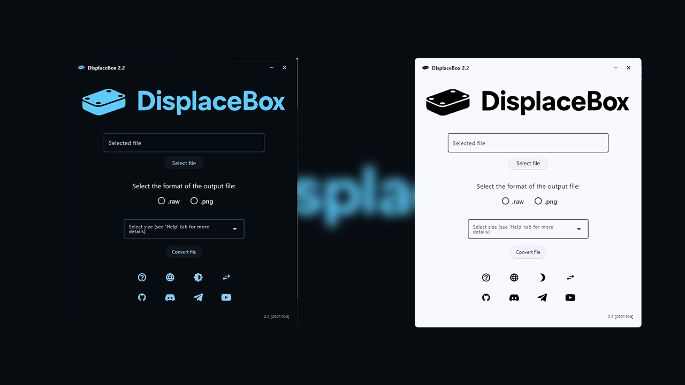
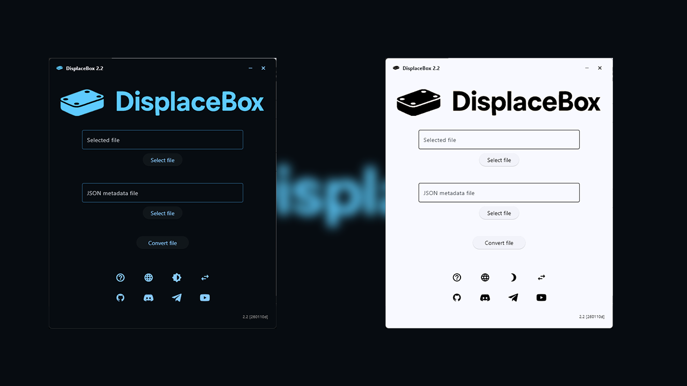
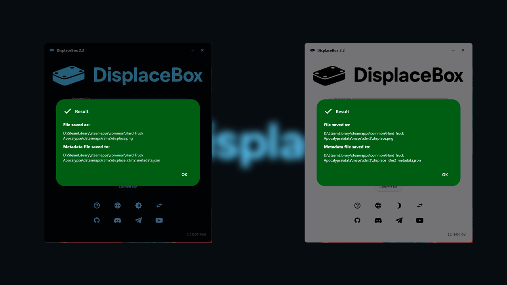
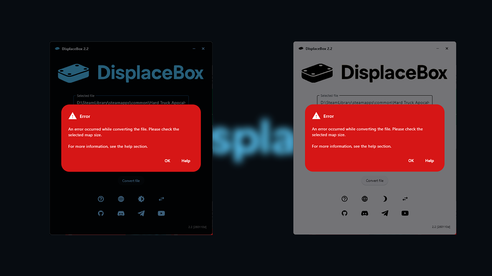
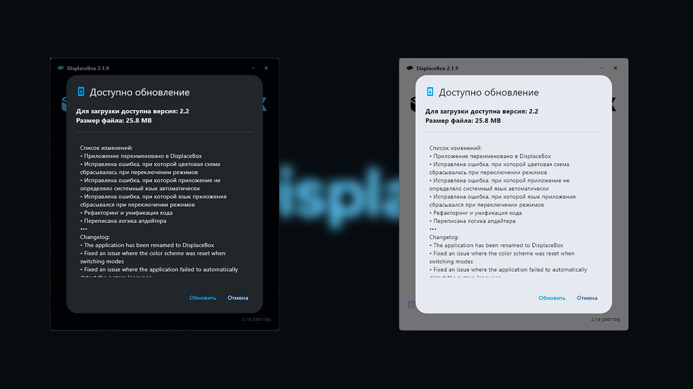

# DisplaceBox


This program helps you convert your map’s `displace.bin` files into `.raw` or `.png` formats. It is designed to simplify the conversion process.

powered by [python](https://github.com/python/cpython) & [flet](https://github.com/flet-dev/flet)

## Table of Contents

- [Features](#features)
- [How to Use](#how-to-use)
- [Screenshots](#screenshots)
- [Download](#download)
- [Requirements](#requirements)
- [Installation](#installation)
- [Run from Source](#run-from-source)
- [License](#license)
- [Authors](#authors)

## Features

- **File Selection**: Choose the `displace.bin` file from your map folder.  
- **Format Selection**: Choose the output file format (`.raw` or `.png`).  
- **Size Selection**: Choose the map size.  
- **Conversion**: Convert the selected file to the desired format and size.  
- **Help Section**: Provides detailed instructions and information about the program.  
- **Multi-language Support**: The program supports the following languages — Russian, English, Ukrainian, Belarusian, and Polish.  

**IMPORTANT**: Ukrainian and Polish localizations have an “unverified” status and may contain errors. If you find any mistakes in the translation, please create an issue or a merge request.

## How to Use

1. **Select File**: Click the “Select File” button to choose the `displace.bin` file from your map folder.  
2. **Select Format**: Choose the output file format (`.raw` or `.png`).  
3. **Select Size**: Choose the map size.  
4. **Convert File**: Click the “Convert File” button to start the conversion process.  
5. **View Result**: If the conversion is successful, you will see a success message, and the converted file will appear in the folder.

## Screenshots

<div align="center">
  






</div>

## Download

**You can download the compiled file here:** https://github.com/stakanyash/displacebin_gui_converter/releases

> [!WARNING]
> The DisplaceBox executable may trigger false positives in some antivirus software. This is a known issue with Python applications compiled into `.exe` files.
>
> DisplaceBox does **not** contain any malicious code. The application only processes local files, performs format conversions, checks for updates, and downloads update packages from the official GitHub repository.
>
> If your antivirus software flags the executable, you may need to add it to the exceptions list.

## Requirements

- Python 3.x  
- Flet  
- PIL (Pillow)  
- struct
- screeninfo

## Installation

1. Clone the repository:  
   ```bash
   git clone https://github.com/stakanyash/displacebin_gui_converter.git```

2. Navigate to the project directory:

   ```bash
   cd displacebin_gui_converter
   ```

3. Install the required dependencies:

   ```bash
   pip install -r requirements.txt
   ```

## Run from Source

To run the program, execute the following command:

```bash
python src/main.py
```

## License

This project is licensed under the MIT License. See the [LICENSE](LICENSE) file for details.

## Authors

* **Program Author**: stakan
* **Conversion Script Author**: [ThePlain](https://github.com/ThePlain)
